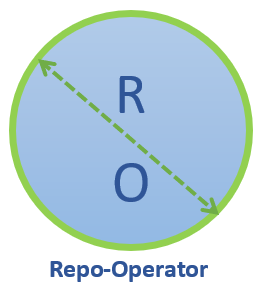

<p align="center"></p>
<p align="center">
</p>

# repo-operator

**repo-operator** provides easy life cycle management of a package repository and it's associated objects.
   
**repo-operator** is an attempt to automate creation of package repository of particular type and manage through the namespace using it. 

The operator watches for an object of particular type _**"Repository"**_ in the namespaces and as soon as it finds it or observes changes to existing, it will reconcile to create required repositories based on specified field values.

:frog: NOTE : This Operator does not manage/Upgrade any artifact repository manager (like Artifactory..) but instead it manages/upgrades repository resources like package repositories, user permission etc.

:loudspeaker: Currently, **repo-operator** supports - [Jfrog Artifactory](https://jfrog.com/artifactory/) which is widely used with-in industry as universal artifact repository manager. 

## What is an Operator?
Operators are software extensions to Kubernetes that make use of custom resources to manage applications and their components. Operators follow Kubernetes principles, notably the control loop.
Read more about it [here](https://github.com/operator-framework)

## Motivation

Almost all projects now-a-days uses an artifact repository manager to resolve application dependencies or store release artifacts/images. If also building and deploying their images on a managed kubernetes cluster then it is a good idea to keep those repositories somehow connected to the namespaces to keep track and manage everything at one place.  

With this approach user can treat their repository as a kubernetes object in their namespace and make changes. This automation also removes man in the middle and helps to standardize. It also provides required wiring when images need to be pushed to external registry.  

## How it is built?

* The boiler-plate code for this operator is generated through the [kubebuilder](https://github.com/kubernetes-sigs/kubebuilder) framework.  
* It uses [go modules](https://github.com/golang/go/wiki/Modules).
* It relies on [artifactory rest api](https://www.jfrog.com/confluence/display/RTF/Artifactory+REST+API) to create required objects.  
* The idea is to keep it generic so that it can support other repository managers like nexus, pulp etc going forward.

## CustomResourceDefinitions

The Operator acts on the _**Repository**_  [custom resource definitions (CRDs)](https://kubernetes.io/docs/tasks/access-kubernetes-api/extend-api-custom-resource-definitions/): The Operator ensures all the time that repository of particular type exists in the Artifactory, it also allow you modify Permission object by add/remove user.  


### Getting started
:point_right: [Get started with repo-operator](docs/installing.md)

## Development

:white_check_mark: Pre-Requisite
* [go](https://golang.org/dl/) version v1.12+.
* [docker](https://docs.docker.com/install/) version 17.03+.
* [kubectl](https://kubernetes.io/docs/tasks/tools/install-kubectl/) version v1.11.3+.
* [kustomize](https://sigs.k8s.io/kustomize/docs/INSTALL.md) v3.1.0+.
* [Access to a Kubernetes](https://kubernetes.io/docs/concepts/configuration/organize-cluster-access-kubeconfig/) v1.11.3+ cluster.
* [Kubebuilder](https://book.kubebuilder.io/quick-start.html) (Required only if you want to make changes to the CRD structure)
* Install Make
```
sudo apt-get install build-essential
```

* Launch :rocket:
```
make install

make run
``` 

## Contributing

Please read more about ["How to contribute"](CONTRIBUTING.md)